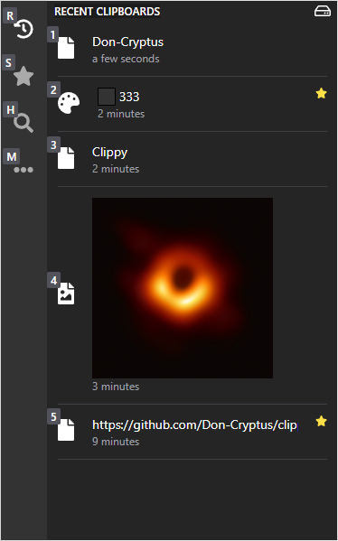

<p align="center">
  <a href="https://github.com/0-don/clippy">
    
  </a>
  <p align="center">
    <br />
    privacy focused clipboard manager with sync & encryption
    <br />
    <a href="https://github.com/0-don/clippy/releases/latest">Try it out</a>
    ·
    <a href="https://github.com/0-don/clippy/issues">Report Bug</a>
    ·
    <a href="https://github.com/0-don/clippy/issues">Request Feature</a>
    <br />
  </p>
  <p align="center">
    
  </p>
</p>

<div align="center">

<a href="https://github.com/0-don/clippy/releases/download/v1.5.13/clippy_1.5.13_x64-setup.exe">
   Windows x64
</a>
•
<a href="https://github.com/0-don/clippy/releases/download/v1.5.13/clippy_1.5.13_arm64-setup.exe">
  Windows ARM64
</a>
<br>
<a href="https://github.com/0-don/clippy/releases/download/v1.5.13/clippy_1.5.13_amd64.deb">
   Linux x64 (deb)
</a>
•
<a href="https://github.com/0-don/clippy/releases/download/v1.5.13/clippy-1.5.13-1.x86_64.rpm">
  Linux x64 (rpm)
</a>
•
<a href="https://github.com/0-don/clippy/releases/download/v1.5.11/clippy-bin-1.5.11-1-x86_64.pkg.tar.zst">
  Linux x64 (pkg.tar.zst)
</a>
•
<a href="https://github.com/0-don/clippy/releases/download/v1.5.13/clippy_1.5.13_amd64.AppImage">
  Linux x64 (AppImage)
</a>
<br>
<a href="https://github.com/0-don/clippy/releases/download/v1.5.13/clippy_1.5.13_arm64.deb">
  Linux ARM64 (deb)
</a>
•
<a href="https://github.com/0-don/clippy/releases/download/v1.5.13/clippy-1.5.13-1.aarch64.rpm">
  Linux ARM64 (rpm)
</a>
•
<a href="https://github.com/0-don/clippy/releases/download/v1.5.13/clippy_1.5.13_aarch64.AppImage">
  Linux ARM64 (AppImage)
</a>
<br>
<a href="https://github.com/0-don/clippy/releases/download/v1.5.13/clippy_1.5.13_universal.dmg">
   macOS (Universal)
</a>
<br>
<br>

</div>

### Package Managers

**Linux:**

```bash
yay -S clippy-rs-bin
sudo snap install clippy-clipboard
flatpak install flathub io.github._0_don.clippy
sudo dnf copr enable 0-don/clippy && sudo dnf install clippy
```

**macOS:**

```bash
brew install --cask 0-don/clippy/clippy
```

**Windows:**

```powershell
winget install 0-don.clippy
scoop bucket add clippy https://github.com/0-don/scoop-clippy && scoop install clippy
choco install clippy-clipboard
```

**Nix:**

```bash
nix-env -iA nixpkgs.clippy-clipboard
```

### Features

- **Multi-content support:**
  - Text, HTML, RTF support
  - Image support with thumbnails
  - File support with metadata
- **Smart clipboard features:**
  - Type out clipboard content (where pasting isn't allowed) **ctrl+b**
  - Smart search for links, colors, images, hex codes etc.
  - Add favorite clipboards
  - Clear history by type
- **Security & Privacy:**
  - End-to-end encryption support
  - Password protection
  - Replace patterns
  - Configurable size limits for different content types
- **Cloud sync:**
  - Google Drive integration
  - Sync favorites and history
  - Configurable sync limits
- **Customization:**
  - Global hotkeys for all functions
  - Custom keybinds
  - Adjustable display scale
  - Dark/Light mode
  - Multiple languages support
  - Configurable window positions
  - Database location customization
- **System Integration:**
  - Autostart option
  - System tray support
  - Display toggle with **ctrl+y** or **ctrl+d**

### Prerequisites Development

Before you begin, ensure you have met the following requirements:

- [Rust](https://www.rust-lang.org/tools/install)
- [Node.js](https://nodejs.org/en/download/)
- [Tauri](https://tauri.app/v1/guides/getting-started/prerequisites/)

### Installation and Running the Application

1. **Install Dependencies:**
   First, install the necessary Node.js dependencies:

   ```bash
   npm install
   ```

2. **Run the Application in Watch Mode:**
   To start the Tauri application in watch mode, use:
   ```bash
   npm run d
   ```

#### tested on

- Linux(x11) KDE Plasma (Disable Focus Stealing Prevention)
- Windows
- Mac (run command below to remove quarantine attribute)

```bash
xattr -r -d com.apple.quarantine /Applications/clippy.app
```

<!-- DEBIAN GNOME X11 -->
<!-- su - -->
<!-- usermod -aG sudo don -->
<!-- echo "disable wayland" && sudo nano /etc/gdm3/daemon.conf -->
<!-- sudo apt install ./clippy_1.3.0_amd64.deb -->
<!-- sudo apt install pkg-config libglib2.0-dev libwebkit2gtk-4.1-dev libgtk-3-dev libayatana-appindicator3-dev librsvg2-dev -->

<!-- OPENSUSE KDE X11 -->
<!-- sudo zypper --non-interactive install -t pattern devel_basis && sudo zypper --non-interactive install glib2-devel webkit2gtk3-devel gtk3-devel libopenssl-devel libayatana-appindicator3-1 libayatana-appindicator3-devel -->
<!-- sudo zypper install ./clippy-1.3.0-1.x86_64.rpm -->

<!-- sudo dnf install gcc gcc-c++ make pkg-config glib2-devel webkit2gtk4.1-devel gtk3-devel openssl-devel libayatana-appindicator-gtk3-devel -->

<!-- ENDEVOUROS KDE X11 -->
<!-- sudo pacman -U clippy-bin-1.3.0-1-x86_64.pkg.tar.zst -->

<!-- git reset --hard origin/master -->

<!-- PACKAGE MANAGER PRs -->
<!-- Winget: https://github.com/microsoft/winget-pkgs/pull/353083 -->
<!-- Flathub: https://github.com/flathub/flathub/pull/8231 -->
<!-- AppImage Hub: https://github.com/AppImage/appimage.github.io/pull/3725 -->
<!-- Nix: https://github.com/NixOS/nixpkgs/pull/504239 -->
