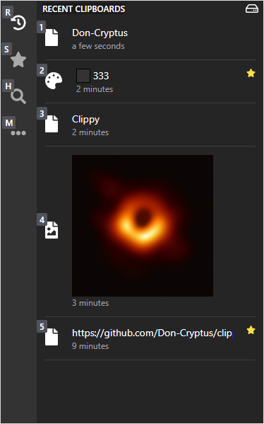

Clippy's **Clipboard History** is a powerful tool that captures and manages your clipboard activity, enabling you to retrieve past content quickly and efficiently. Whether you're working with text, images, or files, Clippy ensures your data is always within reach.

## Key Features

---

### Multi-Content Support

- **Text, HTML, RTF**: Store different text formats effortlessly.
- **Images**: Automatically generates **thumbnails** for easy preview.
- **Files**: Captures file paths and displays **metadata**.

### Smart Clipboard Capabilities

- **Smart Search**: Easily find clips by link, color code, image, hex value, and more.
- **Favorites**: Mark frequently used clipboard entries for quick access.
- **Delete entries**: Click on the recycle bin icon to remove an entry from the clipboard.
